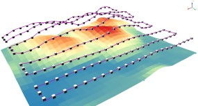
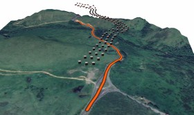
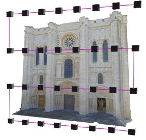
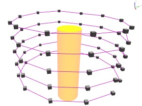
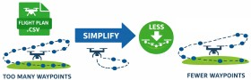
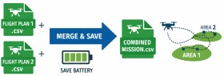

# GeoFlight Planner (QGIS Plugin)

  

GeoFlight Planner is a **QGIS plugin for drone mission planning** focused on photogrammetry and inspections.  
It creates **ready-to-fly CSV missions (Litchi-compatible)** and QGIS layers (flight lines + waypoints), with tools for **terrain following**, **linear corridor mapping**, **CSV waypoint optimization**, and a built-in **mission calculator** (GSD/overlap/spacing/ideal speed).

---

## Table of contents
- [Key features](#key-features)
- [Installation](#installation)
- [Tools](#tools)
  - [Horizontal Flight](#horizontal-flight)
  - [Vertical Flight](#vertical-flight)
  - [CSV Tools](#csv-tools)
  - [Mission Calculator](#mission-calculator)
- [Requirements](#requirements)
- [Tips](#tips)
- [How to contribute](#how-to-contribute)
- [Authors](#authors)
- [License](#license)

---

## Key features
- ✅ **Horizontal missions** with **terrain following** (DEM-based) or fixed altitude.
- ✅ **Linear corridor missions** (roads, channels, pipelines, coastlines) with **2–5 parallel routes**.
- ✅ **Vertical missions** for **facades** and **circular** structures.
- ✅ **CSV waypoint simplification** (reduce waypoint count while preserving the path shape).
- ✅ **Merge CSV missions** (execute two areas sequentially in one continuous flight).
- ✅ **Mission Calculator** for **GSD, overlap, spacing, altitude**, and **ideal speed** (motion blur / shooting interval / optional PPK constraints).

---

## Installation
1. Download or clone this repository.
2. Copy the folder `qgis-drone-flight-planner` into your QGIS plugins directory:
   - **Windows:** `%APPDATA%\QGIS\QGIS3\profiles\default\python\plugins`
   - **Linux:** `~/.local/share/QGIS/QGIS3/profiles/default/python/plugins`
   - **macOS:** `~/Library/Application Support/QGIS/QGIS3/profiles/default/python/plugins`
3. Restart QGIS → **Plugins → Manage and Install Plugins…** → enable **GeoFlight Planner**.

---

## Tools

### Horizontal Flight

  

These tools generate **horizontal (nadir) missions** and export a **Litchi-compatible CSV** plus optional QGIS layers.

- **1. Following terrain – Sensor**  
  Terrain-following workflow using DEM and flight parameters derived from sensor/GSD logic.

- **2. Following terrain – Manual**  
  Same goal, but you manually provide key distances (side/front spacing) and flight attributes.

- **3. Following terrain – RC2 Controller**  
  Mission preparation designed for workflows using an RC2-style controller logic.

- **4. Following terrain – Line**  
  Create a **linear corridor mission** from a single **axis line**, generating **2–5 parallel routes** (optionally including the axis) and automatically placing photo waypoints along each route.  
  If a **DEM** is provided and *Above Ground (Follow Terrain)* is enabled, waypoint altitude is adjusted to keep a consistent height above ground.

  

---

### Vertical Flight
Vertical tools are designed for inspections and 3D capture of structures.

- **Facade** (Vertical 1)  
  Plans a façade mission with vertical progression and point placement suitable for 3D reconstruction/inspection.

- **Circular** (Vertical 2)  
  Generates circular missions around an object/structure.

  
  

---

### CSV Tools

  
  

- **1. Simplify Waypoints**  
  Reduces the number of waypoints from an existing mission CSV, keeping the overall path shape.  
  Useful for drones/apps with **waypoint limits** or when missions become unstable due to excessive points.  
  Optionally loads: original points, flight line, and simplified points into QGIS.

- **2. Merge CSV files**  
  Combines **two mission CSV files** into one output CSV so they can be executed **sequentially** (e.g., area A → area B) **without returning to the takeoff point**, saving time and battery.  
  Optionally loads the merged points layer into QGIS for quick validation.

---

### Mission Calculator

  

Accessible from the plugin menu as **“GSD and Overlap – Mission Calculator”**.

Includes practical calculators for planning:
- **GSD** (from sensor parameters) and **Altitude from target GSD**
- **Ideal spacing** from desired **overlap (%)**
- **Overlap** from an existing spacing
- **Ideal flight speed** guidance (motion blur limit, shooting interval limit, and optional PPK/GNSS constraint)

Reference docs bundled with the plugin:
- `calculator/calculator.html`
- `calculator/ideal_speed_calculator_docs.html`

---

## Requirements
- **QGIS 3.x** (plugin is built for QGIS Processing and supports modern QGIS versions).
- For some tools:
  - **DEM raster** (GeoTIFF, etc.) is required for **terrain following**.
  - **LFTools** plugin is required for the 3D simplification workflow that samples DEM values for waypoints.

---

## Tips
- Keep your input layers **saved to disk** and **not in edit mode** (the plugin validates this to avoid broken outputs).
- For terrain following, prefer a DEM with resolution compatible with your mission scale.
- For CSV tools, ensure your CSV contains the standard fields (e.g., `latitude`, `longitude`, and altitude fields used by your app/workflow).

---

## How to contribute
- Report issues and suggestions using the GitHub tracker.
- Share test datasets (CSV + DEM + expected behavior) to help reproduce issues.
- If you want to support development, consider learning the full workflow and sharing feedback from real projects.

---

## Authors
- **Prof. Cazaroli**
- **Dr. Leandro França**
- **Prof. Ilton Freitas** (contributor)

---

## License
See [LICENSE](LICENSE).
